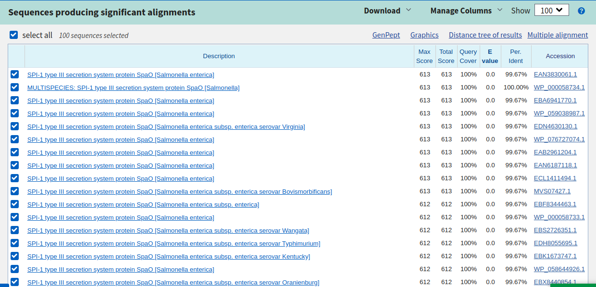

 ## 
 Mini Project 1: Gene Finder Reflection 

###### 
 Sam Coleman 

#### Results
Using Protein Blast, I was able to take my output from the gene_finder function and search for proteins containing that sequence of amino acids. The output of my function had over 100 proteins with a 100% match to my function output. Below is a sample from the results. One of the candidates is SPI-1 type III secretion system protein SpaO \[Salmonella enterica]. This gene codes for protein transfer into host cells by the bacteria [(European Bioinformatics Institue).](https://www.ebi.ac.uk/QuickGO/term/GO:0030254) This is a pathogen that can cause infection in humans. Another candidate is FliI/YscN family ATPase \[Salmonella enterica]. This gene allows the transport of various compounds across a membrane. While these gene itself isn't pathogenic and is required to allow any life to form and function. This gene allows the Salmonella to function.

#### Reflection
Gene finding technology has a large oppurtunity to benefit others. This type of technology can be used to analyze the DNA of someone who is sick to better diagnose and treat them. While this isn't necessary every time you are sick and go to the doctor, at some times it is necessary to both protect you and the greater population. This is extremely timely, as the World Health Organization declared Coronavirus a global health emergency last week. When someone presents with symptoms that could be due to the Coronavirus, their DNA can be analyzed to see if that is the pathogen causing their illness. If the test returns a posiive result for Coronavirus present, proper precautions can be taken to ensure the safety of the population. (In this case, precautions would also be taken before the results were determined due to the nature of Coronavirus.)

This program could have negative consequences if it is used beyond what it's explicitly good for. For example, if you were to enter different people's DNA into it, you can try to find similarities and differences between people. This could lead to unjustly drawn conclusions about people. This also ties into the data collected about you from sending your DNA to companies such as Ancestry DNA and 23 & Me.
